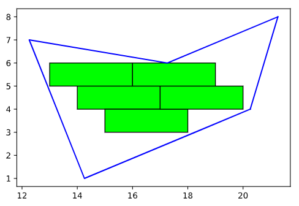

# Rect_in_Poly
Pack identical rectangles into a polygon as many as possible, **continously in the same orientation**

# The origin 
I recently ran into an interesting problem when remodeling my house: how to pack as many **identical** rectangles (such as tiles or floor planks) as possible into a polygon area, **continuously of the same orientation**. 

Althought [packing problem](https://en.wikipedia.org/wiki/Packing_problems) is classic in computer science, I couldn't find a solver easily -- although there is [a Fortran solver](https://www.ime.usp.br/~egbirgin/packing/). So I wrote the code myself. 

My problem is slightly easier than general packing problem in that all rectangles are of the same size, and they need to form a **continous, closed region**. However, one restriction is that rows of tiles need to have the same indentation in order to be visually appealing. 

# The code 

I use a brutal-force solution as the search space is manageable given that all rectangles are of the same size and the row offset (default resolution 1 unit or 1 foot) is a constant. 

I first create an array of rectangles, and then check how many rectangles can fit into the polygon. To search for the best solution, I  vary the row indentation and rotate the polygon (default angular resolution: 15 degrees). The angle and offset that yield the maximal count of rectangles are returned, and visualized. I also move around the array to find their best fit with the polygon. 

To check whether a rectangle fits into a polygon, I take advantage of `matplotlib`'s `Path` class. It has a function called [`contain_points()`](https://matplotlib.org/stable/api/path_api.html#matplotlib.path.Path.contains_points). 

One more thing that made this easy is that it's pretty much all integers. In the US, most tiles and planks are of rounded feet. 

# Examples 

You can find the solutions to the example problem in the code in the folder [test](./test). One plot is one candidate solution. In each plot, the rectangles that can fit into the polygon are filled in green. The red bricks are the array generated. If you go over the solutions, you will notice that the polygon rotates and/or the brick offset changes. The filenames are `{angle}_{offset}.png`. 

Some examples: 

# Known bugs 

Because I only check whether all four corners of a rectangle are inside of a polygon, the case below may happen: 

# Contact me 

I saw how my contractors calculated the layouts for tiles, floor planks, bricks, etc. in my house this summer. They used very simple math to achieve very suboptimal solutions. I really want to build a mobile app to help them. If you are interested, please contact me. 
